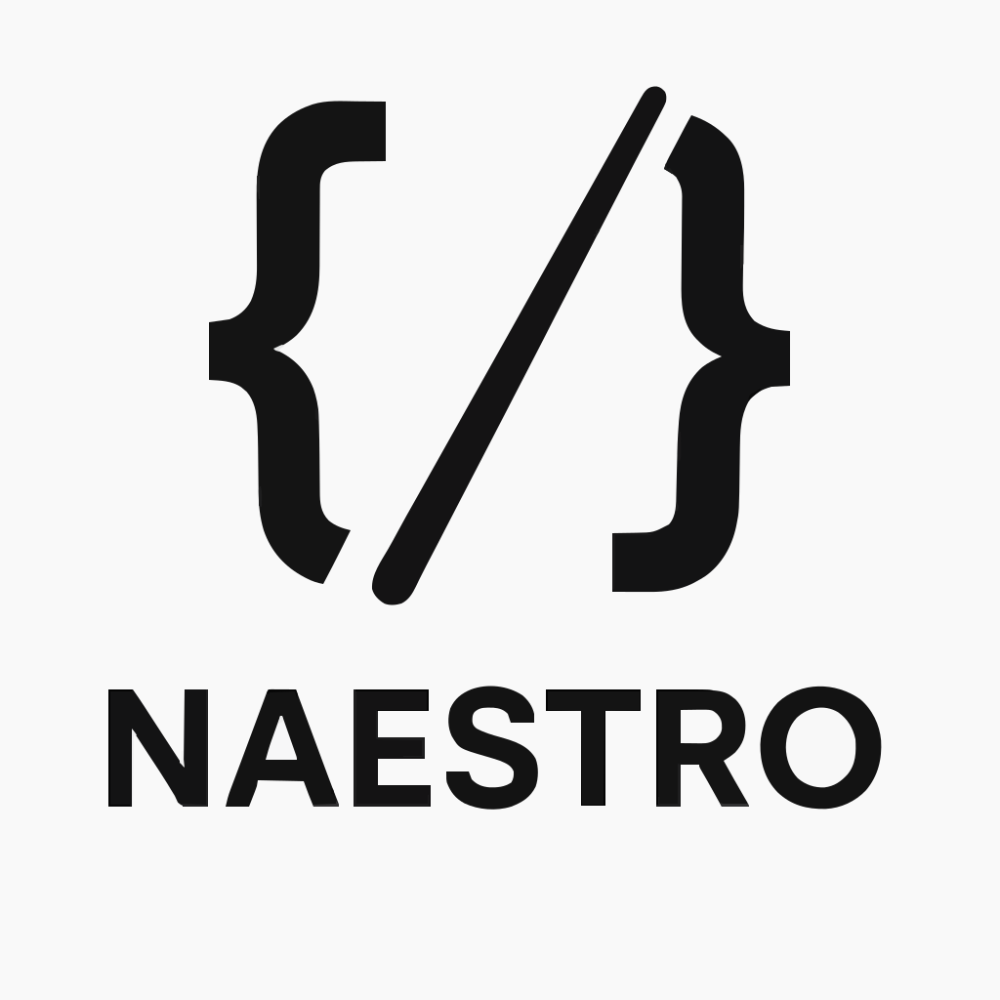

# NAESTRO — Orchestrator Platform

[![CI][ci-badge]][ci] [![Release Please][rp-badge]][release-please] [![Reference Links][ref-badge]][ref]
[![Coverage][cov-badge]][codecov]

[ci-badge]: https://github.com/cputer/naestro/actions/workflows/ci.yml/badge.svg?branch=main
[ci]: https://github.com/cputer/naestro/actions/workflows/ci.yml
[rp-badge]: https://github.com/cputer/naestro/actions/workflows/release-please.yml/badge.svg
[release-please]: https://github.com/cputer/naestro/actions/workflows/release-please.yml
[ref-badge]: https://github.com/cputer/naestro/actions/workflows/reference-link-check.yml/badge.svg?branch=main
[ref]: https://github.com/cputer/naestro/actions/workflows/reference-link-check.yml
[cov-badge]: https://codecov.io/gh/cputer/naestro/branch/main/graph/badge.svg
[codecov]: https://codecov.io/gh/cputer/naestro

  

**Production-grade LLM orchestrator** with LangGraph-style workflow execution, pgvector-backed RAG,
secure sandboxing, and multi-model routing (NIM / vLLM / SLM).

Naestro is an AI Orchestrator for multi-model collaboration. Review the
[orchestrator collaboration guide](docs/orchestrator_collaboration.md) for collaboration modes and
depth.

📖 Read the [Whitepaper](./WHITEPAPER.md)  
➡️ See the [Roadmap](./ROADMAP.md) 🌌 Explore the [Vision](./VISION.md)

See also: [References](./REFERENCES.md) for external tech and source links.

---

## Vision

Naestro is designed to evolve into a continuously improving **Autonomous System** capable of
orchestrating agents, managing tools, rewriting itself safely, and solving open-ended tasks — from
research and code generation to SEO, Geo analytics, and multimodal interaction.

📖 Read the full [Vision](./VISION.md)

---

## Documentation

- [Whitepaper](./WHITEPAPER.md)
- [Architecture](./ARCHITECTURE.md)
- [Single-node deployment](docs/DEPLOY_SINGLE_NODE.md)
- [Multi-node deployment](docs/DEPLOY_MULTI_NODE.md)
- [Apple sidecars](docs/APPLE_MODELS.md)
- [Integrations](docs/INTEGRATIONS.md)
- [Graphiti Guide](docs/GRAPHITI.md)
- [Orchestrator collaboration](docs/orchestrator_collaboration.md)
- [Studio ↔ Core API contract](docs/UI_API_CONTRACT.md)
- [VS Code Extension](docs/VS_CODE_EXTENSION.md)
- [No-Replit deployment](docs/NO_REPLIT_DEPLOY.md)

### Scale-out from single node

Naestro runs great on a single DGX Spark desktop. When you’re ready to expand across multiple
desktops (“cells”), see [Multi-node deployment](docs/DEPLOY_MULTI_NODE.md). Cells register with the
router; the scheduler places steps by VRAM headroom, temperature, and queue pressure—local-first
with cloud spillover only when needed.

### Naestro Studio (local UI)

First-party dashboard (React + Vite + Tailwind + shadcn/ui) served by Naestro Core on the DGX.  
Real-time Live Runs, model metrics, GPU health, KV cache hit-rate, cloud spillover %, and
incidents.  
See [Studio ↔ Core API contract](docs/UI_API_CONTRACT.md) and
[Single-node deployment](docs/DEPLOY_SINGLE_NODE.md).

To configure the WebSocket base URL during build, run:

    VITE_SOCKET_BASE_URL=https://naestro.example.com npm run build

### VS Code Extension (Qoder-style)

A lightweight extension that talks to Naestro Core (/api/runs, /ws/live) to refactor code, explain
errors, and generate tests **without leaving the IDE**.  
Spec and scaffolding guidance in [VS Code Extension](docs/VS_CODE_EXTENSION.md).

---

## ✨ Features

- **Agentic Orchestration** — multi-phase workflows you can trace and audit.
- **Multi-Model Routing** — cost/latency-aware routes across NIM, vLLM, and a small model tier.
- **RAG on Postgres + pgvector** — BM25 + cosine + feedback reranker.
- **Secure Sandbox** — Docker-executed verification with seccomp + no-network.
- **PII Calibration** — Shannon entropy thresholds with a 550-item dataset.
- **Observability First** — OTEL traces, Prometheus metrics, Grafana dashboards.
- **CI/CD** — GitHub Actions with healthchecks and hooks for shadow/canary logic.
- **Interactive Web UI** — Vite-powered React dashboard with Monaco editor.
- **SymPy & SciPy Demos** — quadratic solving and sine integration.
- **Firecrawl Web Ingestion** — crawl sites with policy controls, evaluate coverage, extract
  headings, and embed pages ([docs](docs/integrations/firecrawl.md)).

See the [User Manual](docs/USER_MANUAL.md) for a complete guide.

---

## 🚀 Usage Scenarios

- **RAG-based question answering** — retrieve documents and synthesize answers through
  LangGraph-style workflows.
- **Multi-model routing** — pick between NIM, vLLM, and small LLMs based on cost or latency targets.
- **Sandbox verification** — execute snippets inside a seccomp-restricted Docker container with no
  network access.

---

## Quick Start

Core services (gateway, orchestrator, postgres, redis):

    docker compose up -d --profile core

Optional inference tier (requires GPU & NVIDIA NGC login):

    docker compose up -d --profile inference

Optional monitoring:

    docker compose up -d --profile monitoring

Health checks:

    curl http://localhost:8080/health
    curl http://localhost:8081/health

Install SciPy for numeric demos:

    pip install scipy

If enabling the inference profile (NIM/SLM from nvcr.io/\*), authenticate first:

    docker login nvcr.io
    # Use your NVIDIA NGC API key/token

---

## Local Development

Use Node.js 22.x for all Node-based tooling (see `.node-version` and `.nvmrc`).

Install Python dependencies:

    pip install -r requirements.lock
    pip install -r scripts/requirements.txt
    python scripts/install_nltk_data.py

Start services with hot reload:

    uvicorn src.orchestrator.main:app --reload --port 8081 &
    uvicorn src.gateway.main:app --reload --port 8080 &

---

## 🧰 Environment

Create a `.env` from the example:

    cp .env.example .env

---

## Memory

Naestro includes Graph Memory with Graphiti → see [Graphiti Guide](docs/GRAPHITI.md).

---

## 🗂 Structure

    docs/            # logo, diagrams
    src/gateway/     # FastAPI entry service
    src/orchestrator # Orchestrator service
    sql/schema.sql   # pgvector schema + indexes
    etc/docker/      # sandbox config
    config/          # prometheus + otel
    scripts/         # pinning, governor, validation
    jobs/            # PII calibration
    .github/         # CI
    docker-compose.yml

---

## 🔬 Example Scripts

See [Examples](docs/examples.md).

---

## 📄 Architecture

See [Architecture](ARCHITECTURE.md).

---

## 🔒 Security

See [Security](SECURITY.md).

---

## 🧹 Pre-commit

    pip install pre-commit
    pre-commit install

---

## Testing

    pytest -m "not slow" -q --cov=src --cov-report=xml

---

## 🤝 Contributing

Contributions welcome! Open an issue or PR. Run tests/linters before submitting.

---

## License

MIT — see [License](LICENSE).

---

## Compatibility Matrix

| Component         | Version | Compatible With               |
| ----------------- | ------- | ----------------------------- |
| Core Orchestrator | v1.4.x  | Studio v0.9+, Providers v0.6+ |
| Studio (UI)       | v0.9.x  | Core v1.4+, Graphiti v0.3+    |
| Providers schema  | v0.6+   | Core v1.4+                    |

> Automated updates via Dependabot.

---

## Appendices / Key Integrations

- **Firecrawl** — web crawl & extract.
- **Gitingest** — repo → digest.
- **Nanobrowser** — browser-based web automation.
- **AutoAgent** — clustered agents.
- **MetaCLIP2** — multilingual vision-text embeddings for cross-modal retrieval and grounding.
